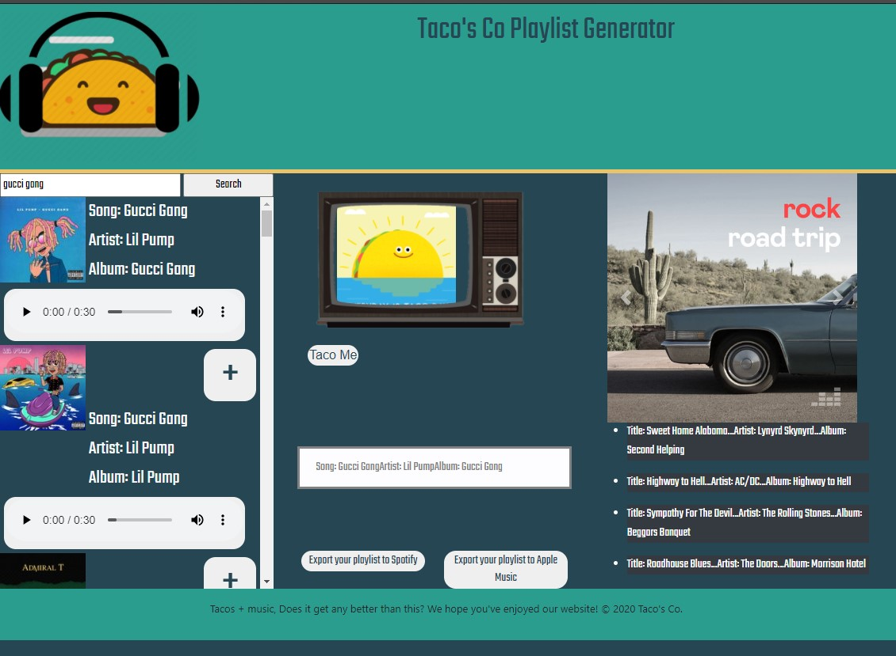

# Music-API-Group-Project
* [Deployed Project](https://noracurcio.github.io/Music-API-Group-Project/)
* [Repository](https://github.com/noracurcio/Music-API-Group-Project.git)
* 

## Introduction
Taco CO's musical playlist generator helps you to search for music, create and organize searched songs into a playlist that you can then import into your local Spotify and iTunes programs. Our application it the first of it's kind to also feature TacoTV, which displays unique gif files while you listen to music!

## Technical
The Taco's Co. Playlist Generator utilizes the Deezer and giphy APIs, bootstrap, jQuery and animate libraries.

### API Information:
Deezer API Key: 

| Metric        | Weight | 
| ---           | ---    |
| Concept       | 10%    |
| Design        | 20%    |
| Functionality | 30%    |
| Collaboration | 30%    |
| Presentation  | 10%    |

 Must use at least two server-side APIs

* Must use a CSS framework _other than_ Bootstrap

* Must be interactive (i.e: accept and respond to user input)

* Use at least one new third-party API

* Must have a polished UI

* Must meet good quality coding standards

* Does not use alerts, confirms or prompts (look into _modals_)

* Must be deployed to GitHub Pages

Taco's Co. creators:
* [Ryan](https://github.com/ryanwit)
* [Nora](https://github.com/noracurcio)
* [Travis](https://github.com/TravCook)
* [Madeline](https://github.com/MadelineCowell)
* [Colby](https://github.com/ctrahan94)
* [Devon](https://github.com/devonp702)
